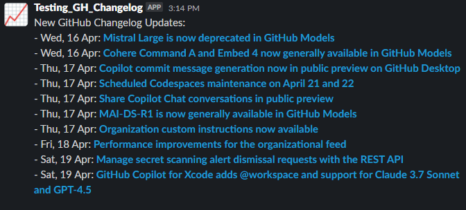

# GitHub Changelog Slack Bot

This project fetches GitHub changelog updates and posts them to a Slack channel. 

Runs automatically via GitHub Actions every Sunday at midnight (UTC) or manually via workflow dispatch. Also configured to run locally too. I made this to help keep maintainers and our teams updated with the latest GitHub changes.



## Features Overview

- Automated weekly execution (Sundays at midnight UTC)
- Manual trigger capability through workflow dispatch
- Run locally without GitHub Actions with local mode
- Secure credential management using GitHub Secrets
- Automated channel posting without manual intervention
- Parses GitHub Changelog RSS feed

## Prerequisites
- Python 3.x
- `SLACK_TOKEN`: Slack bot OAuth token 
- `CHANNEL_ID`: The Slack channel ID can be found at the end of your Slack channel URL, `slack://channel?team={TEAM_ID}&id={CHANNEL_ID}`
- A GitHub repository (private or public)

## Configuring the Slack bot

1. Create a Slack App [here](https://api.slack.com/)
2. Configure required scopes: 
      - channels:join
      - chat:write
      - chat:write.customize
      - links:read
      - links:write
3. Install the app to your Workspace [here](https://api.slack.com/distribution#:~:text=When%20you%20create%20a%20Slack%20app%2C%20you%20associate%20it%20with,on%20behalf%20of%20the%20app.)
4. Invite the Slack bot to your channel by tagging the bot name in a channel message

## Running in GitHub Actions

1. Click 'Use this template' to create your own repository based on this template.

2. Add these credentials to GitHub Actions Secrets:
   - `REPO_OWNER`: Your GitHub username
   - `REPO_NAME`: Your repository name
   - `WORKFLOW_NAME`: The file name of the workflow
   - `SLACK_TOKEN`: Your Slack bot token
   - `CHANNEL_ID`: The ID of the Slack channel receiving posts

## Running Locally

1. Configure your `GITHUB_TOKEN` [here](https://docs.github.com/en/authentication/keeping-your-account-and-data-secure/managing-your-personal-access-tokens).

2. Install the required dependencies:
   ```bash
   pip install -r requirements.txt
   ```

3. Create a `.env` file:
   ```bash
   cp .env.example .env
   ```

4. Edit the `.env` file and fill in your credentials:
   - `GITHUB_TOKEN`: Your GitHub personal access token
   - `SLACK_TOKEN`: Your Slack bot token
   - `CHANNEL_ID`: The ID of the Slack channel receiving posts

5. Run the script:
   ```bash
   python run_local.py
   ```

## To-Do

This template works as is, but could use some improvements:

- unit tests for core functionalities
- debug artifact download in GHA
- return type hints in the fetch script
- error handling for local runs
- replace print() with logging
- modularize the config file for easier validation